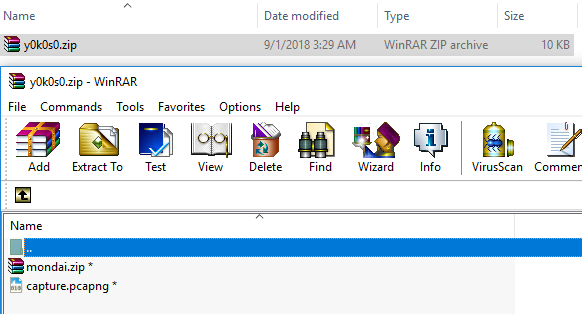

# Đây là một challenge misc khá thú vị. File ở đây [source](mondai-77791222cdec2fe04bc20eafdb3b330c284d59e35046811c84b47d074e068906.zip)

## Bước 1

File `capture.pcapng`, `mondai.zip` được nén zip có đặt password là tên của file zip đấy: `y0k0s0`



## Bước 2

Mở file `capture.pcapng` bằng wireshark, bao gồm 23 gói tin `ICMP`.


Độ dài của trường `data` trong mỗi gói ICMP là 1 kí tự ascii. Có thể quan sát gói tin được ping đến địa chỉ ip 192.168.11.5 không bị lỗi và chỉ cần lọc gói echo-request để lấy độ đài dữ liệu:

```
from scapy.all import sniff

pcap = sniff(offline='capture.pcapng')

for packet in pcap:
	# Ping to 192.168.11.5 not error
	# Type of ICMP message:
	## 0: icmp echo-reply
	## 8: icmp echo-request
	## 11: icmp time exceeded

	if packet['IP'].dst=='192.168.11.5' and packet['ICMP'].type == 8:
		print(chr(len(packet.load)), end='')

# We1come
```

## Bước 3

Có thể đoán password là 1 dòng trong 1000 dòng trong file list.txt


```
from zipfile import ZipFile

filepwd = open('list.txt', 'r')

for passwd in filepwd:
	with ZipFile('mondai.zip') as zf:
		try:
			zf.extractall(pwd=passwd.strip().encode())
			print(passwd.strip().encode())
		except Exception as e:
			pass
# eVjbtTpvkU
```

## Bước 4

`1c9ed78bab3f2d33140cbce7ea223894` là file có được sau khi giải nén. Sử dụng lệnh `file` để xác định định dạng của file.


Chuỗi `1c9ed78bab3f2d33140cbce7ea223894` có độ dài là 32 byte, có thể phỏng đoán là md5. Giải mã trên https://www.hashkiller.co.uk/md5-decrypter.aspx ra được kết quả `happyhappyhappy`

## Bước 5

Gợi ý là `password is too short` từ file README.txt. Từ đó mình có ý tưởng là bruteforce mật khẩu. Có thể dùng code python để thực hiện, code tại đây: https://github.com/mnismt/CompressedCrack

```
$ python crack.py -i ~/tmp/mondai.zip
> tm
> tn
> to
> Complete
> ('Time:', 0.356849, 's')
> ('Password:', 'to')
```

## Kết luận

```
Congratulation!
You got my secret!

Please replace as follows:
(1) = first password
(2) = second password
(3) = third password
...

TWCTF{(2)_(5)_(1)_(4)_(3)}
```

Flag là sự kết hợp của 5 mật khẩu ở trên. `TWCTF{We1come_to_y0k0s0_happyhappyhappy_eVjbtTpvkU}`
